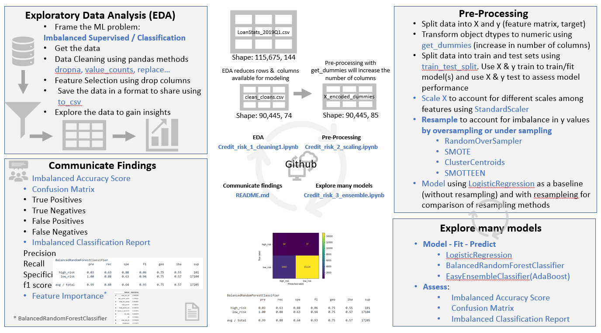
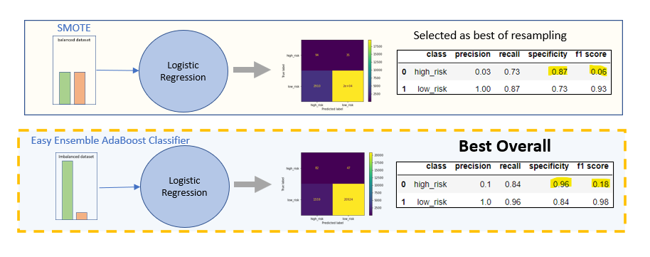
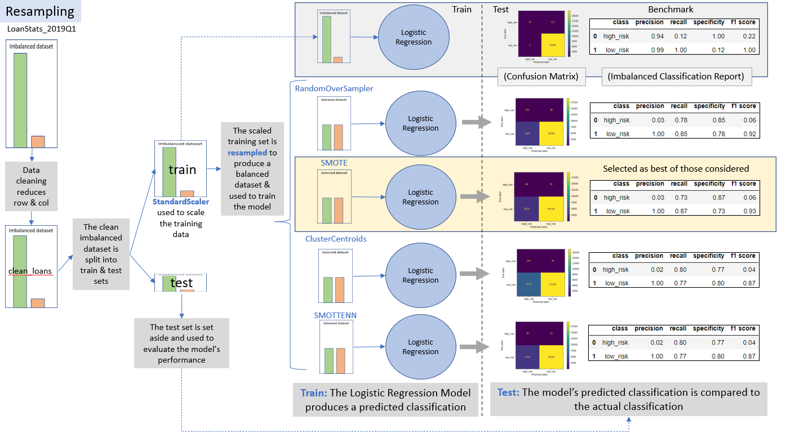
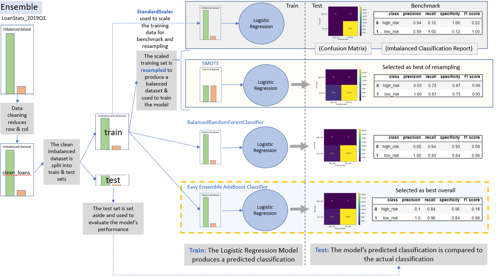

## Big Picture
* Lending Club investers want to explore the use of Machine Learning to classify credit risk as "high risk" or "low risk."

* The Ask: Train several machine learning models on the LoanStats_2019Q1 dataset to classify credit risk using the loans_status column as the "target". 

## The Problem Redefined: 
* Conduct Supervised Machine Learning
* to Classifiy loans as either "high risk" or "low risk"
* see [Lending Club Data Dictionary](https://www.kaggle.com/jonchan2003/lending-club-data-dictionary)
* using loan_status as the target variable within the LoanStats_2019Q1 dataset. Note: values in the loan_status column do not contain "high risk" or "low risk" this will need to be inferred from the current list of values.
* this is an imballanced problem (as per the customer) - less than 1% of loans are characterized as "low risk"
* A list of 86 columns (out of the possible 144 columns) in the LoanStats_2019Q1 have been identified (by the customer) to contain information currently used in determining if a loan is "high risk" or "low risk".
* python and the sklearn and imbalanced learn machine learning libraries have been identified as tools to be used in this analysis. 
* The following ML Classification Algorithms will be used in this analysis: 
     
    * Logistic regression classifier
    * BalancedRandomForestClassifier
    * EasyEnsembleClassifier  
    
- Due to the imballanced nature of this problem the customer has requested the following undersampling / oversampling "pre-processing" algorithms be included in the analysis:
     
    * RansomOverSampler
    * SMOTE
    * ClusterCentroids
    * SMOTEENN  
- Module selection will be based on the following:
     
    * balanced accuracy score
    * confusion matrix
    * balanced classification report  

### Methodology:

### Deliverables:
* Deliverable 1: Use Resampling Models to Predict Credit Risk
* Deliverable 2: Use the SMOTEENN Algorithm to Predict Credit Risk
* Deliverable 3: Use Ensemble Classifiers to Predict Credit Risk
* Deliverable 4: A Written Report on the Credit Risk Analysis 

### Findings:
The logistics regression model using the over/under sampling techniques did not generate an acceptable model; however, SMOTE performed best among the resampling techniques assessed.

The EasyEnsembleClassifier did the best overall in classifying the loan_status as high_risk with an f1 score of 0.18. While not a great model, it performanced best of those considered.

### Deliverable 1 & 2: Use Resampling Models to Predict Credit Risk
* The Logistic Regression Classifier model was used to assess the performance of four resampling techniques. The data was cleaned and feature matrix was scaled using StandardScaler.

* The following metrics were identified for each model:
  - An accuracy score
  - A confusion matrix
  - An imbalanced classification report

* Findings: SMOTE performed best among the resampling techniques assessed with an f1 score of 0.06 and the highest specificity of 0.87

### Deliverable 3: Use Ensemble Classifiers to Predict Credit Risk

The EasyEnsembleClassifier did the best in classifying the loan_status as high_risk with an f1 score of 0.18. While not a great model, it performanced best of those considered.

### The ml-project-checklist.md was referenced for this project
[machine learning checklist](https://github.com/ageron/handson-ml/blob/master/ml-project-checklist.md)