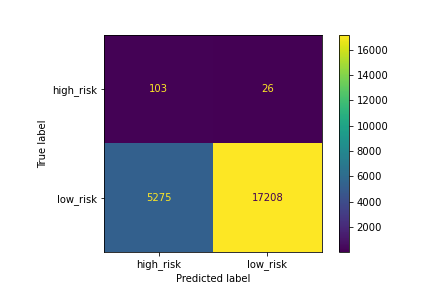

## Big Picture
* Lending Club investers want to imploy Machine Learning to classify credit risk as "high risk" or "low risk."

* The Ask: Train several machine learning models on the LoanStats_2019Q1 dataset to classify credit risk using the loans_status column as the "target". 

## The Problem Redefined: 
* Conduct Supervised Machine Learning
* to Classifiy loans as either "high risk" or "low risk"
* see [Lending Club Data Dictionary](https://www.kaggle.com/jonchan2003/lending-club-data-dictionary)
* using loan_status as the target variable within the LoanStats_2019Q1 dataset. Note: values in the loan_status column do not contain "high risk" or "low risk" this will need to be inferred from the current list of values.
* this is an imballanced problem (as per the customer) - less than 1% of loans are characterized as "low risk"
* A list of 86 columns (out of the possible 144 columns) in the LoanStats_2019Q1 have been identified (by the customer) to contain information currently used in determining if a loan is "high risk" or "low risk".
* python and the sklearn and imbalanced learn machine learning libraries have been identified as tools to be used in this analysis. 
* The following ML Classification Algorithms will be used in this analysis: 
      
    * Logistic regression classifier
    * BalancedRandomForestClassifier
    * EasyEnsembleClassifier   
    
- Due to the imballanced nature of this problem the customer has requested the following undersampling / oversampling "pre-processing" algorithms be included in the analysis:
      
    * RansomOverSampler
    * SMOTE
    * ClusterCentroids
    * SMOTEENN   
- Module selection will be based on the following:
      
    * balanced accuracy score
    * confusion matrix
    * balanced classification report   

### Deliverables:
* Deliverable 1: Use Resampling Models to Predict Credit Risk
* Deliverable 2: Use the SMOTEENN Algorithm to Predict Credit Risk
* Deliverable 3: Use Ensemble Classifiers to Predict Credit Risk
* Deliverable 4: A Written Report on the Credit Risk Analysis 

### Findings:
The logistics regression model using the over/under sampling techniques did not generate an acceptable model

The EasyEnsembleClassifier did the best in classifying the loan_status as high_risk with an f1 score of 0.16. While not a great model, it's performanced was the best of those considered.

### Deliverable 1: Use Resampling Models to Predict Credit Risk
* For all three algorithms, the following were completed:
  - An accuracy score for the model was calculated 
  - A confusion matrix was generated 
  - An imbalanced classification report was generated 

**Benchmark - No over/under sampling**
  - An accuracy score for the model was calculated as 0.9951
  - A confusion matrix was generated  
    

  - An imbalanced classification report was generated  
  - Note: The terms (from left to right are) pre is precision, rec is recall, spe is specificity, f1 is f1-score, geo is geometric mean, iba is index balanced accuracy and sup is support.
    

* **RandomOverSampler**
  - An accuracy score for the model was calculated as 0.8325
  - A confusion matrix was generated  
    

  - An imbalanced classification report was generated  
    
* **SMOTE**
  - An accuracy score for the model was calculated as 0.8325
  - A confusion matrix was generated  
    
  - An imbalanced classification report was generated  
    

* **ClusterCentroids**
  - An accuracy score for the model was calculated as 0.8325
  - A confusion matrix was generated  
    
  - An imbalanced classification report was generated  
    

### Deliverable 2: Use the SMOTEENN Algorithm to Predict Credit Risk
* The combinatorial SMOTEENN algorithm had the following:
**SMOTEENN**
  - An accuracy score for the model was calculated 0.8389
  - A confusion matrix was generated  
    
  - An imbalanced classification report was generated  
    

### Deliverable 3: Use Ensemble Classifiers to Predict Credit Risk
* The BalancedRandomForestClassifier algorithm does the following:
  - An accuracy score for the model was 0.759
  - A confusion matrix was generated  
    
  - An imbalanced classification report was generated  
    
  - The features were sorted in descending order by feature importance  
    

* The EasyEnsembleClassifier algorithm does the following:
  - An accuracy score of the model was 0.9319
  - A confusion matrix was generated  
    
  - An imbalanced classification report was generated  
    

### The ml-project-checklist.md was referenced for this project
[machine learning checklist](https://github.com/ageron/handson-ml/blob/master/ml-project-checklist.md)